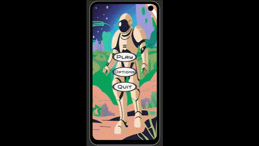
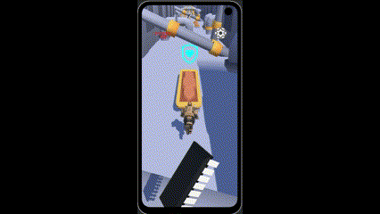
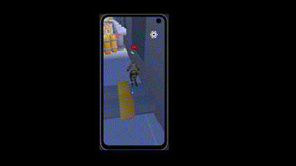
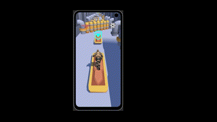
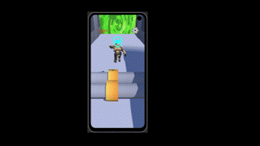

# DimensionRunner
A fast-paced endless runner where you control a space soldier dashing through intergalactic portals while avoiding obstacles. The goal is to survive as long as possible, mastering the mechanics to achieve the highest score.

 

#

# Game Mechanics
## Endless Running
The soldier moves forward automatically, and the player must navigate through dynamic environments.



## Portal System
Run through portals to overcome various obstacles.



## Shield
Dodge the obstacles in your path, but don't worry, your shield will protect you if you get hit! (It will automatically repair itself after a few seconds or by grabbing the components to repair it)


## DifferentPath
Since the obstacles are randomly generated, you can overcome them in different ways:

### _________________ Using the teleport _______________



### _________________ Using the teleport _______________


#
# Problems
## Performance Optimization:
Since the game is designed for smartphones, I implemented pooling and culling to optimize performance.

## Performance:
To optimize performance, I minimized the use of the Update function by implementing Actions, Events, and Coroutines to handle logic only when necessary.

## Floating-Point Precision Issue:
To counter the loss of precision that occurs when moving too far from the origin, I implemented a system that periodically shifts everything back and generates a new map.



#

### Player.cs
``` cs
using System;
using UnityEngine;

public class RunForward : MonoBehaviour
{
    // Reference to the player
    private GameObject Player;

    // Reference to the player's animator
    private Animator PlayerAnimator;

    // Reference to the camera
    [SerializeField] 
    private GameObject Camera;

    // Reference to the player
    private Rigidbody rb;

    // Speed of the player
    private float PlayerSpeed = 5;

    // Number that tracks the player's, camera position and rotation
    private int number = 3;

    // Destination for the player
    private Vector3 Destination;

    // Locations for the player
    private float[] Locations = new float[7];

    // Locations for the camera
    private float[] LocationsCameraX = new float[7];

    // Rotations for the camera
    private Vector3[] Rotations = new Vector3[7];

    // Lerp Speed for the camera
    private float LerpSpeedCamera = 5f;

    // Lerp Speed
    private float LerpSpeed = 5f;

    // Tollerance to check if the player has reached the destination
    private float Tollerance = 0.01f;

    // Bool to check if the player is jumping
    private bool isJumping = false;

    // Jump Force
    private float jumpForce = 6.5f;

    // Events
    public static event Action DamageTaken;
    public static event Action PortalPassed;
    public static event Action CollectableTaken;

    void Start()
    {
        // Set the reference of the player
        Player = this.gameObject;

        // Set the reference of the player's animator
        PlayerAnimator = Player.GetComponent<Animator>();

        // Set the reference of rigidbody
        rb = this.GetComponent<Rigidbody>();

        // Set the destination to the player position
        Destination = Player.transform.position;

        // Set the locations of the player
        Locations[0] = -5f;
        Locations[1] = -4f;
        Locations[2] = -2f;
        Locations[3] = 0;
        Locations[4] = 2f;
        Locations[5] = 4f;
        Locations[6] = 5f;

        // Set the locations of the camera
        LocationsCameraX[0] = -3.5f;
        LocationsCameraX[1] = -3f;
        LocationsCameraX[2] = -1.5f;
        LocationsCameraX[3] = 0;
        LocationsCameraX[4] = 1.5f;
        LocationsCameraX[5] = 3f;
        LocationsCameraX[6] = 3.5f;

        // Set the rotations of the camera
        Rotations[0] = new Vector3(30f, -15f, 0f);
        Rotations[1] = new Vector3(30f, -10f, 0f);
        Rotations[2] = new Vector3(30f, -5f, 0f);
        Rotations[3] = new Vector3(30f, 0f, 0f);
        Rotations[4] = new Vector3(30f, 5f, 0f);
        Rotations[5] = new Vector3(30f, 10f, 0f);
        Rotations[6] = new Vector3(30f, 15f, 0f);
    }

    void Update()
    {
        // Move the player forward
        Run();

        // Set the destination to the new position
        Destination = new Vector3(Locations[number], Player.transform.position.y, Player.transform.position.z);

        // Move the camera to the new position
        MoveCamera();

        // Move the player to the destination
        LateralMovement();

        // Check if the player has passed the portal
        if (Player.transform.position.z > 501.2f)
        {
            //Invoke the event
            PortalPassed?.Invoke();

            // Increase the player speed
            PlayerSpeed += 1f;

            // Reset the player position
            Player.transform.position = new Vector3(0, 0, 0);

            // Reset the camera position
            Camera.transform.position = new Vector3(LocationsCameraX[number], 5, Player.transform.position.z - 5);
        }
    }

    void Run()
    {
        // Move the player forward
        Player.transform.position += new Vector3(0, 0, PlayerSpeed) * Time.deltaTime;
    }

    void LateralMovement()
    {
        // Check if the player is not at the destination
        if (Vector3.Distance(Destination, Player.transform.position) > Tollerance)
        {
            // Move the Player to the Destination
            Player.transform.position = Vector3.Lerp(Player.transform.position, Destination, LerpSpeed * Time.deltaTime);
        }
        else
        {
            // Set the Player to the Destination
            Player.transform.position = Destination;
            if (number == 6)
            {
                // Set the Player to the leftmost position
                Player.transform.position = new Vector3(-5, Player.transform.position.y, Player.transform.position.z);

                // Set the number to the leftmost position
                number = 1;
            }
            else if (number == 0)
            {
                // Set the Player to the rightmost position
                Player.transform.position = new Vector3(5, Player.transform.position.y, Player.transform.position.z);

                // Set the number to the rightmost position
                number = 5;
            }
        }
    }

    public void Jump()
    {
        // Check if the player is grounded
        if (!isJumping)
        {
            // Set to true the jump animation to animate the jump
            PlayerAnimator.SetBool("Jump", true);

            // Play the jump sound effect
            AudioScript.Instance.PlayEffect(AudioScript.Effects.Jump);

            // Set the player to be jumping
            isJumping = true;

            // Reset the vertical velocity of the player
            rb.velocity = new Vector3(rb.velocity.x, 0, rb.velocity.z);

            // Add an impulse force to the player
            rb.AddForce(Vector3.up * jumpForce, ForceMode.Impulse); 
        }
    }

    // Method to check if the player is colliding with the ground
    private void OnCollisionEnter(Collision collision)
    {
            isJumping = false;
            PlayerAnimator.SetBool("Jump", false);
    }

    public void MoveRight()
    {
        // Check if the player is not at the rightmost position
        if (number < 5)
        {
            // Move the player to the right
            number++;

            // Set the tollerance to a smaller value
            Tollerance = 0.01f;
        }
        else
        {
            // Play the portal sound effect
            AudioScript.Instance.PlayEffect(AudioScript.Effects.Portals);

            // Move the player to the leftmost position
            number = 6;

            //  Set the tollerance to a bigger value to make the Transition smoother
            Tollerance = 0.05f;
        }
    }

    public void MoveLeft()
    {
        // Check if the player is not at the leftmost position
        if (number > 1)
        {
            // Move the player to the left
            number--;

            // Set the tollerance to a smaller value
            Tollerance = 0.01f;
        }
        else
        {
            // Play the portal sound effect
            AudioScript.Instance.PlayEffect(AudioScript.Effects.Portals);

            // Move the player to the rightmost position
            number = 0;

            //  Set the tollerance to a bigger value to make the Transition smoother
            Tollerance = 0.05f;
        }
    }

    public void MoveCamera()
    {
        // Move the camera to the new position
        Camera.transform.position = Vector3.Lerp(Camera.transform.position, new Vector3(LocationsCameraX[number], 5, Player.transform.position.z - 5), LerpSpeedCamera * Time.deltaTime);

        // Rotate the camera to the new rotation
        Camera.transform.rotation = Quaternion.Lerp(Camera.transform.rotation, Quaternion.Euler(Rotations[number]), LerpSpeedCamera * Time.deltaTime);
    }

    public void GetCollecatable()
    {
        //Invoke the event
        CollectableTaken?.Invoke();
    }

    public void GetDamage()
    {
        //Invoke the event
        DamageTaken?.Invoke();
    }
}

```

### Procedural Enviroment:
```
using UnityEngine;

public class ProceduralEnvironment : MonoBehaviour
{
    // Array to hold tiles
    [SerializeField]
    private GameObject[] tilesPool;

    // Array to know the tiles that are already spawned
    private bool[] idTileAlreadySpawned;

    // Preffixed tiles
    [SerializeField]
    private GameObject startTile;
    [SerializeField]
    private GameObject preStartTile;
    [SerializeField]
    private GameObject preEndTile;
    [SerializeField]
    private GameObject endTile;

    // Postion to spawn the tiles
    private Vector3 spawnPosition = Vector3.zero;

    // Length of each tile
    private float tileLength = 10f;

    // Number of tiles to spawn
    private int numberTilesToSpawn = 50;

    // Random tile
    private int randomTile;

    void Start()
    {
        fillArray();
        // Loop through the tiles
        for (int i = 0; i < numberTilesToSpawn; i++)
        {
            // Create the scenario
            MoveTiles(i);
        }
    }

    private void OnEnable()
    {
        // Subscribe to the event
        RunForward.PortalPassed += ResetTiles;
        TileScript.OrganizeTiles += DeactivateTile;
    }

    private void OnDisable()
    {
        // Unsubscribe to the event
        RunForward.PortalPassed -= ResetTiles;
        TileScript.OrganizeTiles -= DeactivateTile;
    }

    public void MoveTiles(int i)
    {
        // Preffixed tiles
        if (i == 0)
        {
            startTile.transform.position = spawnPosition;
        }
        else if (i == 1)
        {
            preStartTile.transform.position = spawnPosition;
        }
        else if (i == 48)
        {
            preEndTile.transform.position = spawnPosition;
        }
        else if (i == 49)
        {
            endTile.transform.position = spawnPosition;
        }
        else
        {
            // Check if the tile is already spawned
            do
            {
                // Randomly select a tile
                randomTile = Random.Range(0, tilesPool.Length);

            } while (!idTileAlreadySpawned[randomTile]);

            // Set the bool to true, so the tile is already moved
            idTileAlreadySpawned[randomTile] = false;

            // Set the tile position
            tilesPool[randomTile].transform.position = spawnPosition;
        }

        // Move the spawn position forward for the next tile
        spawnPosition += new Vector3(0, 0, tileLength);
    }


    private void organizeTiles(int i)
    {
        // calculate the x and z position of the tile
        int x = i % 10;
        int z = i / 10;

        // Move the tile to the new Organized position
        tilesPool[i].transform.position = new Vector3(x * -12, 0, z * -12);
    }

    public void ResetTiles()
    {
        //Play the portal Effect
        AudioScript.Instance.PlayEffect(AudioScript.Effects.Portals);

        // Reset the spawn position
        spawnPosition = Vector3.zero;

        // Reset the array
        fillArray();

        // Activate all the tiles
        ActivateAllTiles();

        // Loop through the tiles
        for (int i = 0; i < numberTilesToSpawn; i++)
        {
            MoveTiles(i);
        }
    }

    private void fillArray()
    {
        // Initialize the array to the TilesPool length
        idTileAlreadySpawned = new bool[tilesPool.Length];
        // Loop through the tiles
        for (int i = 0; i < idTileAlreadySpawned.Length; i++)
        {
            // Set bool to true, so the tile is already spawned
            idTileAlreadySpawned[i] = true;
        }
    }
    private void ActivateAllTiles()
    {
        // Loop through the tiles
        for (int i = 0; i < idTileAlreadySpawned.Length; i++)
        {
            // Activate the tile
            tilesPool[i].gameObject.SetActive(true);
        }
    }

    // Deactivate the tile
    public void DeactivateTile(GameObject tile)
    {
        // Loop through the tiles
        for (int i = 0; i < idTileAlreadySpawned.Length; i++)
        {
            // If the tile is the one to deactivate
            if (tile == tilesPool[i])
            {
                // Organize the tiles
                organizeTiles(i);
            }
        }
    }

}

```
